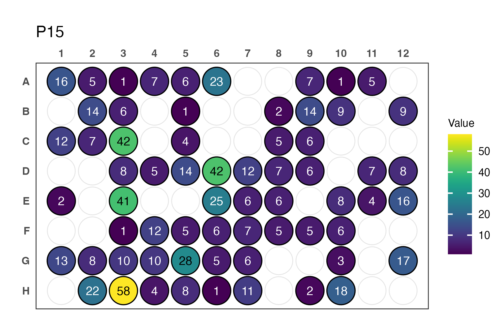

# clonality

clonality is an R package for automated clonotype assignment of B or T cell receptor sequences.
It helps identify clonal relationships based on V gene, J gene, and CDR3 similarity, including optional fuzzy subclustering.
Also, it supports various data formats including IMGT output and 10x Genomics filtered_contig_annotations.tsv.

#Instalation:

```R
devtools::install_github("victoraLab/clonality")
```

# How to use it:

The tra and trb objects are small sequencing datasets that can be used as a test

```R
head(tra)
clonality(data = tra, output = "tra.output", vgene_col = "V_GENE_and_allele", jgene_col = "J_GENE_and_allele")
```

BCR Example Pipeline (with IMGT dataset)

```R
clonality(data = IMGT_BCR_Summary_File, cdr3_col = "DNA_Junction", cell = "B", mismatch = 90)

analysed_contigs <- analyze_well_contigs(output, barcode_format = "WELL_PLATE")

plate_metadata <- extract_plate_metadata(df = analysed_contigs$real_contigs_input, barcode_format = "WELL_PLATE")

plate_quality <- evaluate_plate_quality(analysed_contigs)

plot_plate_contig_depth(plate_metadata, plate_id = "P09")
```


TCR Example Pipeline (with IMGT dataset)

```R
clonality(data = IMGT_TCR_Summary_File, cdr3_col = "DNA_Junction", cell = "T")

analysed_contigs <- analyze_well_contigs(output, barcode_format = "PLATE_WELL")

plate_metadata <- extract_plate_metadata(df = analysed_contigs$real_contigs_input, barcode_format = "PLATE_WELL")

plate_quality <- evaluate_plate_quality(analysed_contigs)

plot_plate_contig_depth(plate_metadata, plate_id = "P01")
```




