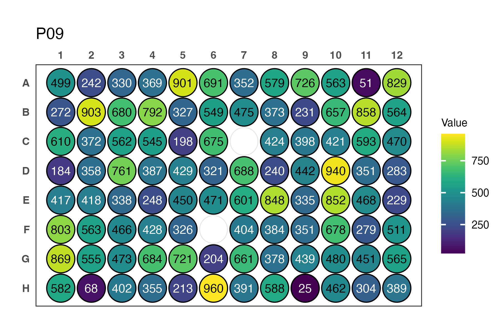
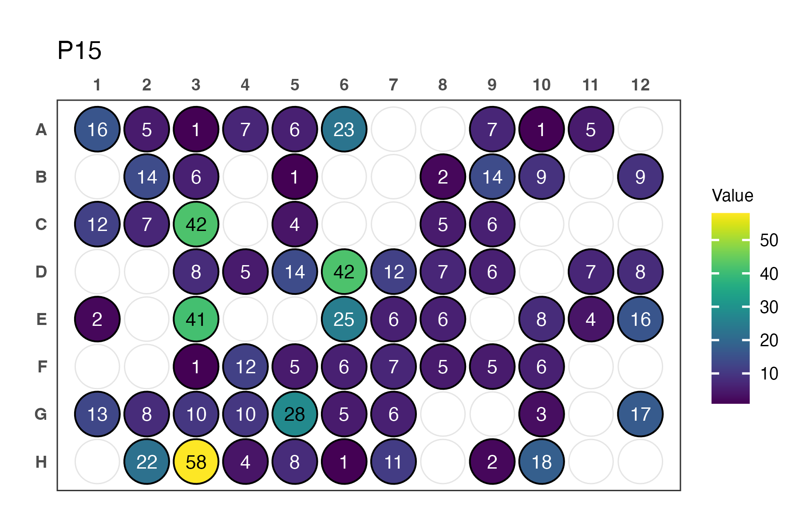

# clonality

`clonality` is an R package for automated clonotype assignment of B or T cell receptor sequences.
It helps identify clonal relationships based on V gene, J gene, and CDR3 similarity, including optional fuzzy subclustering.
It supports **IMGT datasets** as well as **10x Genomics Cell Ranger (v3 and v7) V(D)J outputs**.

---

## Installation

```R
devtools::install_github("victoraLab/clonality")
```

## Basic use

```
head(tra)

clonality(
  data        = tra,
  output      = "tra.output",
  vgene_col   = "V_GENE_and_allele",
  jgene_col   = "J_GENE_and_allele"
)
```

## Analysis pipeline for BCR plate sequencing

```
output <- clonality(data = IMGT_BCR_Summary_File,
                    cdr3_col = "DNA_Junction",
                    cell = "B",
                    mismatch = 90)

analysed_contigs <- analyze_well_contigs(output, barcode_format = "WELL_PLATE")
plate_metadata   <- extract_plate_metadata(df = analysed_contigs$real_contigs_input,
                                           barcode_format = "WELL_PLATE")
plate_quality    <- evaluate_plate_quality(analysed_contigs)

plot_plate_contig_depth(plate_metadata, plate_id = "P09")]
```


## Analysis pipeline for TCR plate sequencing

```
output <- clonality(data = IMGT_TCR_Summary_File,
                    cdr3_col = "DNA_Junction",
                    cell = "T")

analysed_contigs <- analyze_well_contigs(output, barcode_format = "PLATE_WELL")
plate_metadata   <- extract_plate_metadata(df = analysed_contigs$real_contigs_input,
                                           barcode_format = "PLATE_WELL")
plate_quality    <- evaluate_plate_quality(analysed_contigs)

plot_plate_contig_depth(plate_metadata, plate_id = "P01")
```



# 10x Genomics Example Pipelines

## Example dataset included in the package

```

head(Cellranger9_BCR1)

# Annotate clonality using tenx()
tenx(
  data        = Cellranger9_BCR1,
  method      = "unique_paired",
  cell        = "B",
  only_productive = TRUE,
  only_true_cells = TRUE,
  cellranger_version = 9
)
```

### BCR clonality (Cell Ranger v7 output)

```
# Example dataset included in the package
head(Cellranger7_BCR1)

# Annotate clonality using tenx()
tenx_out <- tenx(
  data        = Cellranger7_BCR1,
  method      = "unique_paired",
  cell        = "B",
  only_productive = TRUE,
  only_true_cells = TRUE,
  clonality_input = c(mismatch = 10),
  cellranger_version = 7
)
```

The result is a clonality-annotated metadata table separated by class

### TCR clonality (Cell Ranger v3 output)

```
# Example TCR dataset
head(Cellranger3_TCR)

# Run tenx() for T cells
tenx(
  data        = Cellranger3_TCR,
  method      = "sticky_ends",
  cell        = "T",
  only_productive = TRUE,
  cellranger_version = 3
)
```

## Integration with Seurat

You can directly embed clonality information into a Seurat object for downstream single-cell analysis:

```
seu <- add_seurat_metadata(
  seu          = my_seurat_object,
  clonal.list  = ls(pattern = "^Clonal"),
  cell         = "T",
  sticky       = TRUE,
  overwrite    = TRUE
)
```


